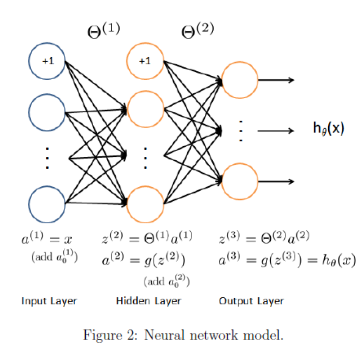

# Nerual-Network-python-implement
Nerual Network python implement Andrew Ng Machine Learning

## Neural Networks

**logistic regression** cannot form more complex hypotheses as it is only a **linear classier**. (You could add more features such as polynomial features to logistic regression, but that can be very **expensive** to train.) 

implement a neural network to recognize **handwritten digits** using the same training set as before

The **neural network** will be able to represent **complex** models that form **non-linear** hypotheses. 

**Feedforward** propagation algorithm to use our weights for prediction

Model

load theta1 and theta2, already train

to predict output

input layer 400 + 1 bias	 middle layer 25  + 1 bias   output layer 10

Theta1 (output layer + 1, input layer)   (25, 401)

Theta2 (middle layer + 1, output layer)  (10, 26)